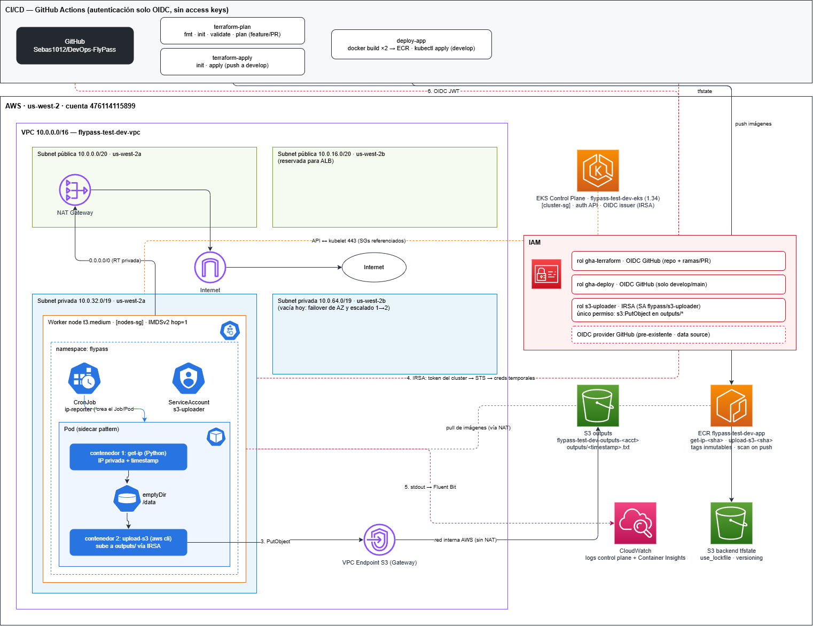

# DevOps FlyPass — Reto técnico Cloud Engineer

Solución al reto técnico: un **CronJob en EKS** que cada 5 minutos obtiene la IP privada del pod, la escribe en un archivo `.txt` cuyo nombre es el timestamp de ejecución, y lo sube a S3 — todo desplegado con **Terraform**, automatizado con **GitHub Actions** y autenticado **sin una sola access key** (OIDC + IRSA).

## Arquitectura



La idea general en 4 líneas:

1. Una **VPC /16** con 2 subnets públicas (NAT / futuro ALB) y 2 privadas (nodos EKS), en 2 AZs.
2. Un cluster **EKS** cuyos nodos viven solo en las subnets privadas: sin IP pública, salida por NAT, y el tráfico a S3 por un **VPC Endpoint** (red interna, sin costo de NAT).
3. Un **CronJob** con un pod de dos contenedores (patrón sidecar) que comparten un volumen: uno escribe el archivo, el otro lo sube a `s3://<bucket>/outputs/`.
4. **GitHub Actions** se autentica en AWS con OIDC y el pod con IRSA: credenciales temporales, emitidas al momento, sin secretos guardados.

## Estructura del repositorio

```
├── .github/workflows/
│   ├── terraform-plan.yml    # feature/PR: fmt, init, validate, plan
│   ├── terraform-apply.yml   # develop (post-merge): init, apply
│   └── deploy-app.yml        # develop: build imágenes → ECR → kubectl apply
├── Dockerfiles/
│   ├── get-ip-app/           # contenedor 1: Python, escribe <timestamp>.txt
│   └── upload-s3-app/        # contenedor 2: sube el archivo a S3 vía IRSA
├── k8s/
│   ├── namespace.yml
│   ├── serviceaccount.yml    # anotado con el rol IRSA
│   └── cronjob.yml           # el pod sidecar, cada 5 minutos
├── Terraform/
│   ├── modules/
│   │   ├── vpc/              # VPC /16, subnets, NAT, route tables, endpoint S3
│   │   ├── eks/              # cluster, node group, SGs, OIDC provider, add-on observabilidad
│   │   ├── s3/               # bucket outputs/ (versioning, cifrado, TLS-only)
│   │   ├── ecr/              # repositorio (tags inmutables, scan on push)
│   │   └── iam/              # roles OIDC de GitHub + rol IRSA del pod
│   └── envs/dev/             # main, variables (con validaciones), outputs, tfvars, backend
└── docs/                     # diagrama de arquitectura
```

Los módulos son genéricos (nada hardcodeado); `envs/dev` decide los valores. Crear otro ambiente es copiar esa carpeta y cambiar el tfvars.

## Cómo funciona el flujo del CronJob

```
CronJob (*/5) ──crea──▶ Pod
                        ├─ get-ip (Python):   obtiene la IP del pod (Downward API),
                        │                     escribe /data/<timestamp>.txt y loguea
                        │                     "Timestamp de ejecución: <timestamp>"
                        ├─ emptyDir /data:    volumen compartido entre ambos
                        └─ upload-s3 (sh):    espera el archivo, lo sube a
                                              s3://<bucket>/outputs/<timestamp>.txt
                                              autenticado SOLO vía IRSA, y termina
```

Detalles que importan:

- **El nombre del archivo es el timestamp** (UTC, sin `:` para que sea una key válida): `2026-07-18T15-25-01Z.txt`. Su contenido: la IP privada y el mismo timestamp.
- El escritor guarda a un `.tmp` y hace **rename atómico**: el uploader nunca ve archivos a medias.
- Un Job termina cuando *todos* sus contenedores terminan — por eso el uploader espera el archivo (con timeout), sube y sale. Si algo falla, el Job reintenta (`backoffLimit: 2`) y nunca corren dos a la vez (`concurrencyPolicy: Forbid`).
- El pod corre sin root, con filesystem de solo lectura y sin acceso al IMDS del nodo — la **única** identidad AWS que puede usar es el rol IRSA, que solo permite `s3:PutObject` sobre `outputs/*`.

## Cómo ejecutar Terraform

**Requisitos**: Terraform ≥ 1.11, AWS CLI con credenciales, y el bucket S3 del backend creado (una sola vez — el backend no puede crearse a sí mismo).

```bash
cd Terraform/envs/dev
terraform init
terraform plan
terraform apply   # ~15-20 min, EKS es lo lento
```

El **primer apply debe ser local**: crea los roles OIDC que los pipelines necesitan para autenticarse (dependencia circular inevitable). A partir de ahí, todo entra por pipeline:

```
feature/* ──push──▶ plan (fmt/init/validate/plan)
    │
    └──PR a develop──▶ check "plan" + 1 aprobación ──merge──▶ apply automático
                                                          └─▶ build + deploy de la app
```

Único secret requerido en GitHub: `AWS_ACCOUNT_ID` (no es una credencial, solo el número de cuenta para armar los ARNs).

## Decisiones técnicas relevantes

| Decisión | Por qué |
|---|---|
| **CronJob** (no Deployment con loop) | La tarea es periódica y de vida corta; un loop infinito no distingue "éxito" de "vivo" y consume recursos 24/7 |
| **OIDC para GitHub Actions** | Cero access keys guardadas; el trust policy limita quién asume cada rol: el de Terraform al repo, el de deploy solo a `develop`/`main` |
| **IRSA para el pod** | Credenciales temporales por-pod con un único permiso (`PutObject` en `outputs/*`); IMDS bloqueado (`hop_limit=1`) para que ningún pod robe el rol del nodo |
| **VPC Endpoint S3 (Gateway)** | El upload viaja por red interna de AWS: gratis, sin pasar por el NAT y sin tocar internet |
| **Un solo NAT Gateway** | Decisión de costo para dev (~32 USD/mes c/u); en prod iría uno por AZ |
| **Endpoint público del API server habilitado** | GitHub Actions y kubectl están fuera de la VPC; restringible por CIDR vía variable. Privado total exigiría VPN o runners self-hosted |
| **Access entries (no `aws-auth`)** | Los permisos dentro del cluster son recursos Terraform auditables, no un ConfigMap frágil |
| **Tags ECR inmutables + tag por SHA de commit** | Trazabilidad exacta imagen↔commit y rollback trivial; nadie puede re-pushear sobre un tag existente |
| **Lock nativo de S3** (`use_lockfile`) | Elimina la tabla DynamoDB: una pieza menos que crear, pagar y permisar (Terraform ≥ 1.11) |
| **OIDC provider de GitHub como data source** | Es único por cuenta y ya existía; referenciarlo (no poseerlo) evita que un `destroy` rompa a otros usuarios de la cuenta |
| **Tags obligatorios vía `default_tags`** | `username`, `environment` y `project` llegan a todos los recursos desde el provider: imposible olvidar uno |

## Observabilidad

- Logs del **control plane** (api, audit, authenticator) en CloudWatch con retención de 30 días.
- Add-on **amazon-cloudwatch-observability**: el stdout de los pods (incluido el log obligatorio `Timestamp de ejecución: <ts>` y líneas JSON estructuradas) llega a `/aws/containerinsights/<cluster>/application`, con métricas y dashboards de Container Insights incluidos.

## Verificación rápida

```bash
aws eks update-kubeconfig --region us-west-2 --name flypass-test-dev-eks
kubectl get cronjob -n flypass                          # programado cada 5 min
kubectl logs -n flypass <pod> -c get-ip                 # "Timestamp de ejecución: ..."
aws s3 ls s3://flypass-test-dev-outputs-<acct>/outputs/ # los .txt con nombre timestamp
```

---

<p align="center">
  <b>Hecho con &#10084; por: Sebastián. </b>
</p>
